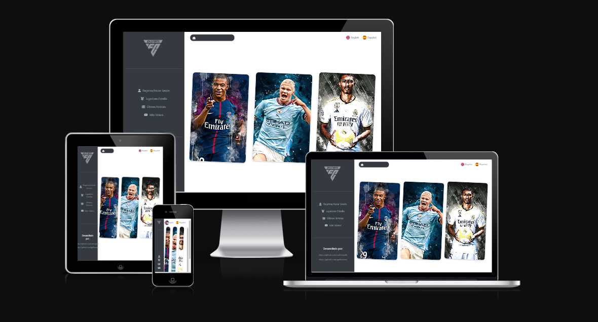
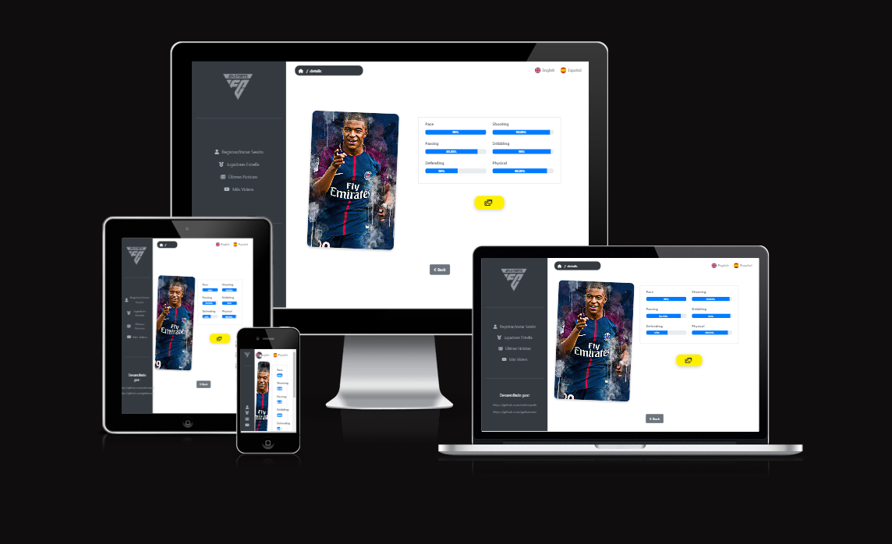
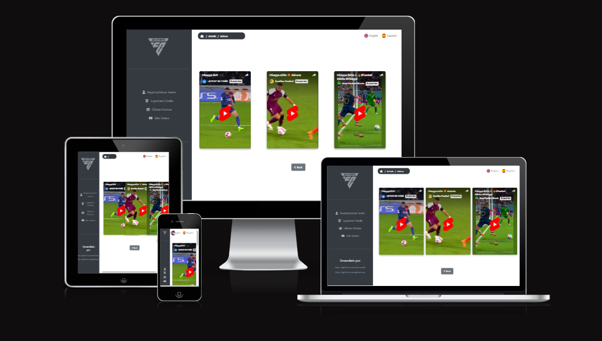

# FIFA-24

FIFA Exam is an Angular-based project designed to check the skills of 3 players. we have used bootstrap to make sure it's responsive and  we have used the translate module so user can change the language. The language they have selected is stored in the local storage

## Getting Started

To get a local copy up and running follow these simple steps.

### Prerequisites

- Node.js
- npm

```bash
npm install npm@latest -g
```

### Development server

Run `ng serve --open` for a dev server. The application will automatically reload if you change any of the source files.

### Build

Run `ng build` to build the project. The build artifacts will be stored in the `dist/` directory.

## Project Structure

The project is organized as follows:

### `/app`

Main directory of the Angular application.

### `/modules`

Contains the application's modules.

#### `/core`

Core module containing contracts, models, and classes used throughout the application.

- **/contracts**: Contains shared interfaces and types.
- **/models**: Contains specific models and interfaces.
  - `player.interfaces.ts`: Interfaces related to the player.
- **/clases**: Contains common classes used in the application.

#### `/players`

Module related to player functionality.

- **/pages**
  - **/home**: Home page.
    - `home-page.component.html`: Home page template.
    - `home-page.component.scss`: Home page styles.
    - `home-page.component.ts`: Home page logic.
    - **/components**: Specific components for the home page.
  - **/details**: Detail page.
    - `detail-page.component.html`: Detail page template.
    - `detail-page.component.scss`: Detail page styles.
    - `detail-page.component.ts`: Detail page logic.
    - **/components**
      - `sheet.component.html`: Sheet component template.
      - `sheet.component.scss`: Sheet component styles.
      - `sheet.component.ts`: Sheet component logic.
  - **/videos**: Videos page.
    - `videos.component.html`: Videos page template.
    - `videos.component.scss`: Videos page styles.
    - `videos.component.ts`: Videos page logic.

### `/services`

Contains the services used in the application.

- `player.service.ts`: Service related to player operations.

### `/shared`

Contains shared components that can be reused in different parts of the application.

- `card.component.html`: Card component template.
- `card.component.scss`: Card component styles.
- `card.component.ts`: Card component logic.
- `sidebar.component.html`: Sidebar component template.
- `sidebar.component.scss`: Sidebar component styles.
- `sidebar.component.ts`: Sidebar component logic.
- `back.component.html`: Back component template.
- `back.component.scss`: Back component styles.
- `back.component.ts`: Back component logic.
- `breadcrumbs.component.html`: Breadcrumbs component template.
- `breadcrumbs.component.scss`: Breadcrumbs component styles.
- `breadcrumbs.component.ts`: Breadcrumbs component logic.

### `/assets`

Contains static resources such as internationalization files.

- **/i18n**
  - `en.json`: English translation files.
  - `es.json`: Spanish translation files.

### `/environments`

Contains specific configurations for different environments.

- `environment.development.ts`: Configuration for the development environment.
- `environment.ts`: Configuration for the production environment.


## NGX-Translate

Offers internationalization support, enabling the application to be easily translated into multiple languages, thus catering to a global audience.

## Responsiveness

Here is an example of the different responsive views of the application:

### Home page



### Details page



### Videos page




## urls 
[main branch vercel ](https://fifa-2024-main.vercel.app/)

[main branch vercel ](https://fifa-2024.vercel.app/)
